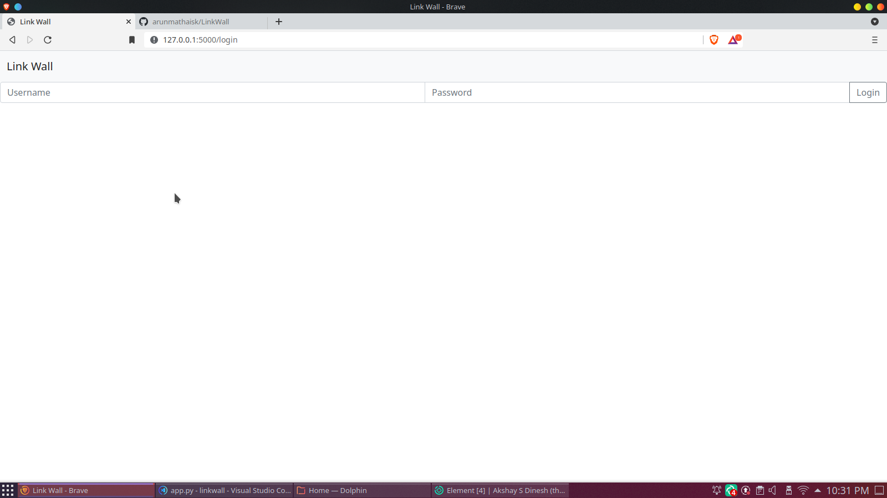
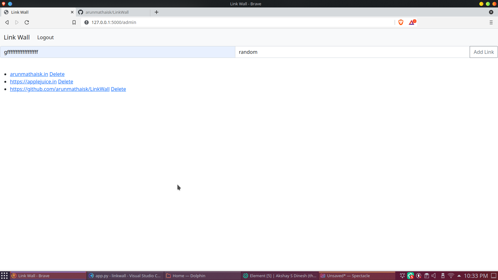
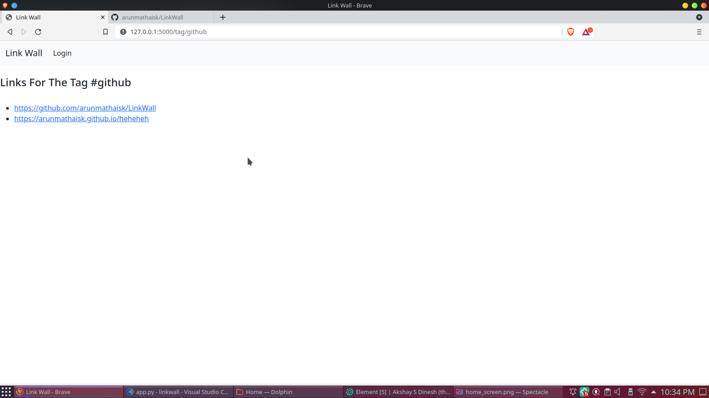

# LinkWall

A useful flask application to manage your links. 
 
Basically a link wall(I know it's a rip off on the bookmark concept)
 
<h3>Home Screen </h3>

 <h3>Login Page </h3>

 <h3>Add a new link </h3>

 <h3>Group By Tag </h3>

